- [Link to Website](https://www.edureka.co/blog/30-pattern-programs-in-java/)

- 1 Question: Pyramid Program
  - 

- 2 Question: Right Triangle Star Pattern
  - 

- 3 Question: Left Triangle Star Pattern
  - 

- 4 Question: Diamond Shape Pattern Program - Difficult
  - 

- 5 Question: Downward Triangle Star Pattern
  - 

- 6 Question: Mirrored Right Triangle Star Program
  - 

- 7 Question: Reversed Pyramid Star Pattern - Difficult
  - 

- 8 Question: Right down Mirror Star Pattern
  - 

- 9 Question: Binary Number Pattern
  - 

- 10 Question: Pascal’s Triangle Program in Java
  - 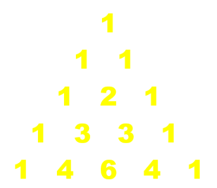

- 11 Question: Simple number program
  - 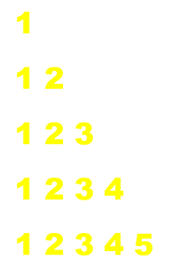

- 12 Question: Number Pattern Program in java
  - 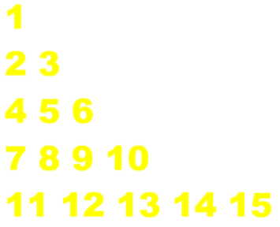

- 13 Question: Diamond Pattern Program in Java
  - 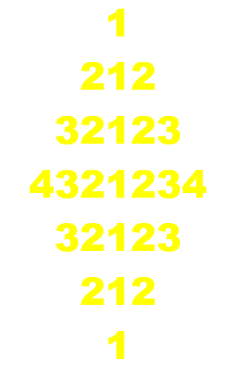

- 14 Question: Number Pattern Program in Java
  - 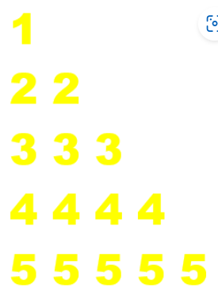

- 15 Question: Descending order Pattern
  - 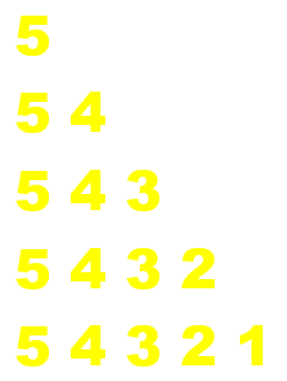

- 16 Question: Right Triangle Numeric Pattern 
  - 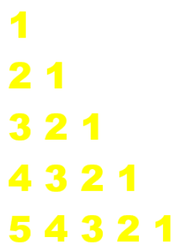

- 17 Question: Zeros/ Ones Pattern Programs
  - 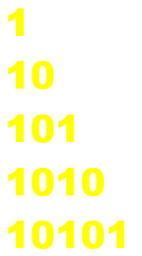

- 18 Question: Diamond Numeric Pattern
  - 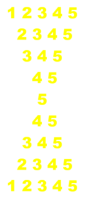

- 19 Question: Right Alphabetic triangle 
  - 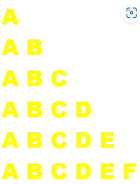

- 20 Question: Alphabet/ Character Pattern Programs
  - 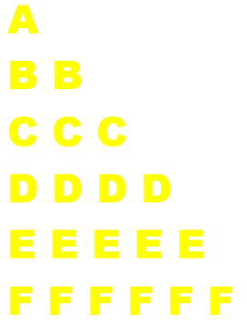

- 21 Question: K Shape Character Pattern Program
  - 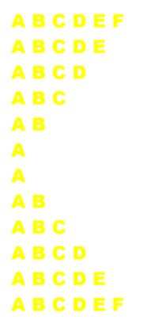

- 22 Question: Triangle Character Pattern Program in Java
  - 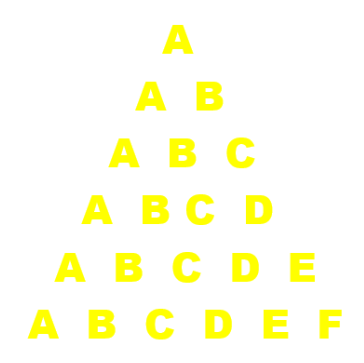

- 23 Question: Diamond Pattern in Java
  - 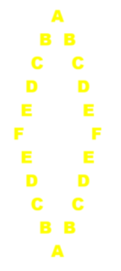

- 24 Question: Right Pascal’s Triangle
  - 

- 25 Question: Left  Triangle Pascal’s
  - 

- 26 Question: Sandglass Star Pattern
  - 

- 27 Question: Hollow Triangle Star pattern
  - 

- 28 Question: Hollow Down triangle
  - 

- 29 Question:
  -

- 30 Question:
  -
