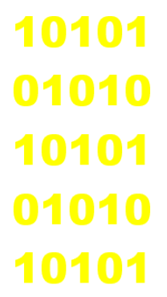

- [Text](https://www.edureka.co/blog/30-pattern-programs-in-java/)

- 1 Question: Pyramid Program
  - 

- 2 Question: Right Triangle Star Pattern
  - 

- 3 Question: Left Triangle Star Pattern
  - 

- 4 Question: Diamond Shape Pattern Program - Difficult
  - 

- 5 Question: Downward Triangle Star Pattern
  - 

- 6 Question: Mirrored Right Triangle Star Program
  - 

- 7 Question: Reversed Pyramid Star Pattern - Difficult
  - 

- 8 Question: Right down Mirror Star Pattern
  - 

- 9 Question: Binary Number Pattern
  - 

- 10 Question:
  -

- 11 Question:
  -

- 12 Question:
  -

- 13 Question:
  -

- 14 Question:
  -

- 15 Question:
  -

- 16 Question:
  -

- 17 Question:
  -

- 18 Question:
  -

- 19 Question:
  -

- 20 Question:
  -

- 21 Question:
  -

- 22 Question:
  -

- 23 Question:
  -

- 24 Question:
  -

- 25 Question:
  -

- 26 Question:
  -

- 27 Question:
  -

- 28 Question:
  -

- 29 Question:
  -

- 30 Question:
  -
